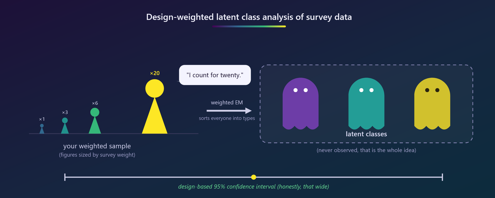

# hot_topic



Measuring **stance in public comments (2000-2025)** with topic models and LLM annotation. A two-script Quarto pipeline: Script 1 discovers and names the topics; Script 2 measures stance toward one stated proposition per selected topic over a census of the in-scope paragraphs, with the validation evidence (inter-model agreement, human-LLM triage, gold-standard metrics) built in rather than bolted on.

The corpus is \~1,200 public comments, often thousands of words spanning several topics, with columns `atom_id` (comment id), `Year` (integer), and `body_english` (text). Chat LLMs cannot judge stance on a whole multi-topic comment even with the topic named in the prompt, so the **measurement unit is the paragraph**, and the whole pipeline is built around that unit.

## Simulate first

Both scripts run end to end with **no real data and no API key**. Script 1 ships with a fenced simulated corpus (era-drifting vocabulary, multi-topic comments); Script 2 ships with a fenced SIMULATED MODE that plants a known stance trend per stratum and fakes each model as a 0.85-fidelity annotator, so batching, checkpointing, agreement, triage, gold validation, and the final tabulation are all exercised and checked against a known answer before a single token is spent. Whatever survives that test is the part to trust in production.

## Architecture

### Script 1: `text_topics.qmd`

Raw comments to named topics.

1.  **Corpus validation** - stops the render with a named error on a bad read (missing columns, duplicate ids, non-integer years).
2.  **Newline diagnostic** - counts line-break conventions and prints samples with visible `<NL>` markers; decision rules choose the paragraph splitter.
3.  **Paragraph atomization** - direction-aware merging: heading-like blocks (short, no sentence-ending punctuation) merge *forward* into the paragraph they introduce; short body fragments merge *backward* into the paragraph they continue.
4.  **EDA** - volume by year, top terms (feeding a domain stop list), era tf-idf (zero-idf terms filtered by definition, not by accident), a descriptive-only lexicon sentiment trend.
5.  **Topic models** - LDA comparator plus STM with `prevalence = ~ s(Year, df = 5)`; K chosen from a manual held-out searchK grid parallelized with `furrr` (stm's own forking is dead on Windows), read off the coherence-exclusivity frontier.
6.  **Naming** - FREX sheet, representative paragraphs, optional LLM label *drafting* (one structured call per topic, frozen to disk, analyst-verified, never fed back into any model).

### Script 2: `llm_stance.qmd` + `llm_stance_source.R`

Named topics to defensible stance estimates. The qmd carries config, prose, and flow; the source file (same folder, `source()`d by relative path) carries the functions in three labeled sections: chat and rater construction, sequential classification with retry, measurement QC.

1.  **LLM API setup** - provider routing off one string (`openrouter/<slug>` now; anything else to the work OpenAI-compatible endpoint), pinned tags at temperature 0, structured output constrained to the label set, an analyst-supplied persona in config, the proposition stated verbatim in the prompt, an `irrelevant` relevance gate. The full system prompt is assembled from six named components, each explained in the document, and printed verbatim.
2.  **Topic lookup CSV** - one analyst-edited file (`topic, label, description, proposition`) drives strata, prompts, and all labeling; the labels start as Script 1's AI drafts, the proposition column is the analyst's alone, and the render stops if a selected topic lacks a row or a proposition.
3.  **Scope** - each paragraph carries its dominant topic (derived by `max.col` over the theta columns, or a saved column via `st$topic_col`); paragraphs whose dominant topic is selected are kept, with an optional `min_theta` floor for topically diffuse ones. No sampling: **every kept paragraph is classified**, a census of the selected-topic paragraphs, so the only cost of scale is calendar, which the budget block states in 300-call quota windows and days.
4.  **Sequential classification** - one request at a time (matching the work API), topic by topic so every prompt carries that topic's proposition, an **incremental label store** that never re-sends a labeled paragraph (interruptions, re-renders, and later-added topics classify only what is new), per-(topic, model) crash checkpoints, and sleep-and-retry recursion that rides quota resets unattended.
5.  **Validation and estimation** - inter-model kappa with the per-class confusion, majority-vote consensus with deterministic ties, non-unanimous items routed to human review, per-class precision/recall/F1 and macro-F1 against a blind stratified gold subsample, then corpus proportions of stance by topic and 5-year era (exact descriptive quantities of the classified census; no interval belongs on them, and the uncertainty story is measurement error, quantified by the gold metrics).

### The contract between them

Script 1 writes `outputs/`; Script 2 reads it and writes `outputs_stance/`.

| File | Producer | Contents |
|------------------------|------------------------|------------------------|
| `paragraphs.parquet` | Script 1 | `para_uid, atom_id, para_id, Year, n_tokens, text` |
| `paragraph_theta.parquet` | Script 1 | the above plus `topic_1..topic_K` (STM theta) |
| `topic_summary.parquet` | Script 1 | topic, prevalence, FREX and PROB words |
| `topic_labels_verified.csv` | analyst | Script 1 naming record (drafts verified by hand) |
| `topics_meta.csv` | analyst | Script 2's lookup: topic, label, description, **proposition** |
| `stance_labels.parquet` | Script 2 | incremental label store, one row per paragraph x model |
| `triage_for_review.csv` | Script 2 | non-unanimous items for the human coder |
| `gold_to_code.csv` / `gold_coded.csv` | Script 2 / analyst | blind validation subsample and its hand codes |
| `stance_by_topic.parquet`, `oppose_by_era.parquet` | Script 2 | corpus proportions |

## Production checklist (condensed; full runbooks live at the top of each script)

1.  Script 1: replace the fenced simulated-data section with one line, `corpus_raw <- arrow::read_parquet("D:/path/to/comments.parquet")` (absolute path; `here()` anchors to the OneDrive root, not the repo).
2.  Read the newline diagnostic; set `tx$para_split` if paragraphs are blank-line separated. Delete `outputs/` once.
3.  Long render with `tx$run_searchK = TRUE`; set `tx$K`; flip the flag off. Name topics (drafts optional, verification mandatory: `outputs/topic_labels_verified.csv`). Set `tx$selected_topics`.
4.  Script 2: set `st$simulated = FALSE` (the one-flag swap; all simulation code lives in one fenced section that overrides `run_rater()`, and nothing after it branches on the mode), set `st$selected_topics`, write one proposition per selected topic in the topics CSV, delete `outputs_stance/` once.
5.  Keys in `.Renviron`, never in code: `OPENROUTER_API_KEY` now; `WORK_LLM_API_KEY` plus `WORK_LLM_BASE_URL` at work. The provider swap is editing `st$models` only.
6.  Production retry settings for the unattended multi-window run: `st$retries = 16L`, `st$retry_wait = 30L * 60L`. Read the budget block (paragraphs, calls per model, windows, calendar days) before committing; models spend their windows concurrently since the quota is per model.
7.  Hand-code `gold_to_code.csv`, save as `gold_coded.csv`, re-render for the validity metrics.

**Caches track files, not code.** Every heavy step checkpoints to disk and reloads on re-render; after editing anything upstream of a checkpoint or switching data or mode, delete the affected file (or the whole outputs folder) once, or stale results reload silently. Stale renders are diagnosed with `tools::md5sum()`.

## Methods and tooling

| Concern | Approach |
|------------------------------------|------------------------------------|
| Paragraph unit | direction-aware atomizer (headings forward, fragments backward), config-driven splitter |
| Topic discovery | `topicmodels::LDA` comparator; `stm::stm` with `prevalence = ~ s(Year, df = 5)`, spectral init |
| Choosing K | manual held-out searchK grid via `furrr` (Windows-safe); coherence-exclusivity frontier |
| Topic naming | FREX sheet + `findThoughts`; optional LLM drafts, analyst-verified file as sole source of record |
| Stance measurement | `llm_stance_source.R` via `ellmer`: sequential calls on `clone()`d chats, structured output (`type_enum`), \>= 2 models, pinned tags, temp 0, analyst persona in config |
| Reliability / validity | `irr` kappa + per-class confusion; consensus + triage; per-class P/R/F1 and macro-F1 vs gold |
| Estimation | census tabulation over the selected-topic paragraphs by topic and era; uncertainty carried by measurement error |
| Rendering | Quarto **Typst** (no LaTeX/tinytex), PNG figures, breakable-figure show rule for tall tables |

## Rendering

``` bash
quarto render text_topics.qmd     # Script 1; searchK is the long chunk
quarto render llm_stance.qmd      # Script 2; census classification is the long chunk
```

Both render to PDF through Quarto's bundled Typst engine (Quarto \>= 1.4). Figures use a PNG device because Typst mishandles complex SVG. Each document opens with `#show figure: set block(breakable: true)` so tall captioned tables break across pages instead of overflowing; wide text tables set `tbl-colwidths` per chunk.

## Transferable lessons

- **Simulate first, always.** A pipeline that has never recovered a planted answer is unverified plumbing.
- **Quarantine the simulation.** All simulation code lives in one deletable fenced section per script; downstream code is branch-free (Script 2's real/fake seam is the single overridden `run_rater()`, and mode differences downstream are data-driven).
- **Caches track files, not code** (see above; the most common source of "impossible" results).
- **tibble data masking:** a column defined earlier in the same `tibble()`/`mutate()` call shadows an environment object of the same name for every later argument. Pull env values into plain locals first, and keep display names (`topic_label`) away from measurement names (`label`).
- **tf-idf degenerates** when every term appears in every document group: `idf = ln(N/df)` is 0 by definition, not by bug; filter and say so.
- **Headings are not paragraphs.** A naive short-fragment rule glues a subtitle's topical words onto the *preceding* paragraph; merge headings forward.
- **LLM labels are measurements with error,** not ground truth: constrain the output, use \>= 2 models, validate per class against human labels, report macro-F1 on imbalanced classes, and remember Cohen's kappa has no validated interpretive thresholds.
- **A census removes sampling error, not measurement error.** With every paragraph classified, no interval belongs on a corpus proportion; the honest uncertainty statement is the gold-quantified per-class error rate.
- **Load `tidyverse` last** so its verbs win over packages that mask them (`stm`, `topicmodels`, ...).

## Files

- `text_topics.qmd` - Script 1: paragraph corpus, EDA, LDA/STM, searchK, topic naming, LLM label drafting.
- `llm_stance.qmd` - Script 2: config, topic CSV lookup, scope, transparent prompt, census stance detection, validation, estimation.
- `llm_stance_source.R` - Script 2's functions (chat/rater, sequential classify with retry, measurement QC); keep it beside the qmd, which `source()`s it.
- `defensible_llm_text_measurement.md` - methodology and verified citations for the LLM measurement.
- `README.md` - this file.

## Lineage

This repo supersedes the single-file validation template (`political_text_topic_evolution.qmd` plus the `source()`d `llm_classify.R`). The simulate-and-recover discipline carried over; the toolkit's stance machinery now lives inline in `llm_stance.qmd` (the legacy files, if still present, are reference only and nothing renders from them).
