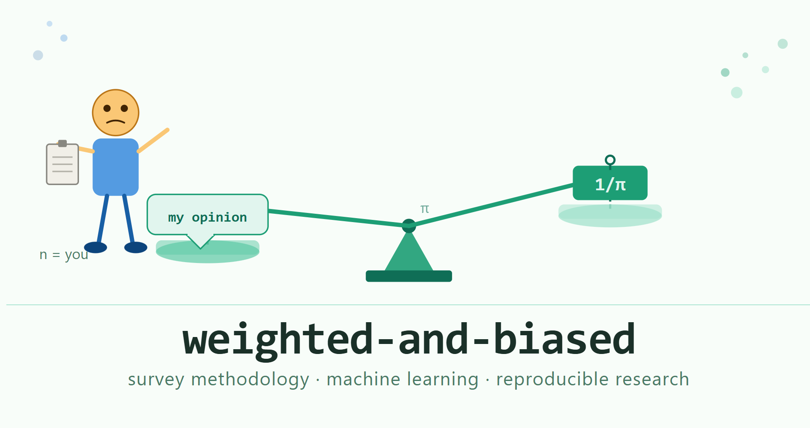

# weighted-and-biased

> *Correcting for who answered. Occasionally correct about other things.*



Personal research repository for work at the intersection of survey methodology, machine learning, and applied statistics. Projects live here when they are either (a) finished enough to share or (b) useful enough to version-control before they become a cautionary tale about undocumented pipelines.

------------------------------------------------------------------------

## Projects

| Project | What it does | Key methods | Status |
|------------------|------------------|------------------|------------------|
| **Design-Weighted LCA** | Estimates latent class models from complex survey data without pretending the weights don't exist | Pseudo-ML EM · JRR/BRR replication variance · Hungarian alignment · bivariate residuals | Manuscript draft |
| **LCA-to-ML Workflow** | Predicts latent class membership from external covariates using machine learning, without the naive classify-then-regress mistake | Posterior probability targets · design-weighted random forests · pseudo-class draws · PSU-grouped validation | Manuscript draft |

Each project folder contains a Quarto manuscript (`.qmd`), a companion documentation file (`_documentation.qmd`), and exported CSVs. Rendering the manuscript reproduces every result, table, and figure.

------------------------------------------------------------------------

## Philosophy

Survey data is not a sample of the internet. It has a design, and the design has a purpose, and ignoring it produces estimates of what happened in your sample, which is a different and smaller place than the world.

Everything here tries to:

- **Weight correctly or say why not.** Horvitz-Thompson is not optional decoration.
- **Report uncertainty honestly.** A standard error from the information matrix, on weighted pseudo-ML estimates, from a clustered sample, is not the right standard error. The replication-based one is.
- **Fabricate nothing.** All numeric claims in the prose are inline code references. If the code doesn't run, the number doesn't appear.
- **State the boundary.** Prediction pipelines license predictions. They do not license causal inference, effect estimates, or press releases.

------------------------------------------------------------------------

## Reproducibility

Every manuscript renders from source. Dependencies are documented in `sessionInfo()` at the end of each rendered document.

``` r
# render a manuscript
quarto render design_weighted_lca_pipeline.qmd

# render the documentation
quarto render design_weighted_lca_documentation.qmd
```

Required packages: `tidyverse`, `matrixStats`, `survey`, `poLCA`, `clue`, `ranger`, `viridisLite`.

No data is fabricated. Simulations use `set.seed()` and fixed parameters. The seeds and parameters are in the code, not the prose.

------------------------------------------------------------------------

## What this is not

- A package. There is no `DESCRIPTION` file and `install.packages` will not help you.
- A textbook. The documentation explains the equations because the equations are load-bearing, not for pedagogical completeness.
- Finished. The manuscript drafts say "draft" for a reason.

------------------------------------------------------------------------

## TSE placement

For anyone arriving from the survey-methods side: these projects sit at the boundary of the representation arm and the measurement arm of the Total Survey Error framework. The weighting corrects representation bias from informative selection. The latent class model is the measurement model. The downstream ML is a prediction exercise on the measurement output. Coverage error, nonresponse bias beyond what the weights encode, and measurement error in the items themselves are noted as limitations and left to future work (or better-funded collaborators).

------------------------------------------------------------------------

## Name

Three simultaneous meanings, all accurate:

1.  The data came from a complex survey and the observations carry design weights.
2.  Without those weights, the estimates are biased.
3.  This is a personal repo and therefore also a personality description.

------------------------------------------------------------------------
