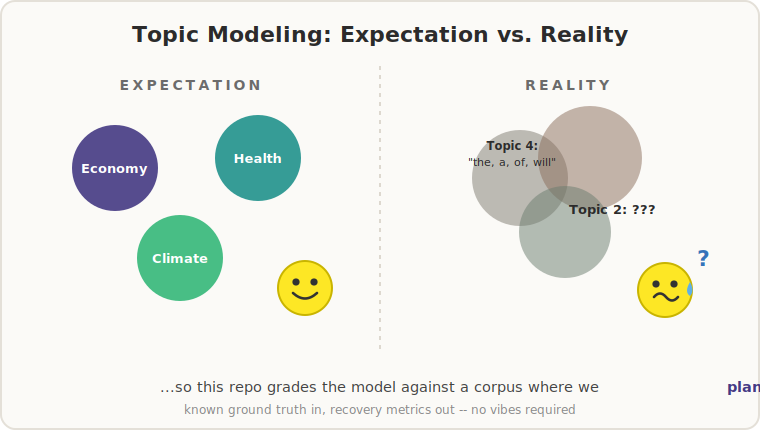

# Validating a Text-Mining Pipeline Against Known Ground Truth

A reproducible Quarto template that builds a full **topic-evolution + sentiment** pipeline and then *proves it works* by recovering structure that was deliberately planted into a simulated corpus. The subject matter (synthetic political commentary over a decade) is just a test fixture — the point is the **method**: how to know whether your text-mining results mean anything when real-world text comes with no answer key.

{width="497"}

## Why simulate?

On real text you can run a topic model, read the top words, nod, and ship it — but you can never check whether the recovered topics, their trends, or the sentiment scores are *correct*, because there is no ground truth to check against. This template inverts the problem: define a known data-generating process (DGP), generate a corpus from it, run the standard pipeline **blind**, and measure how well it recovers what was planted. Whatever survives that test is the part you can trust on real data.

## The pipeline (and the method at each stage)

1.  **Simulation / DGP** — topic prevalence trajectories from a time-indexed softmax; per-document topic mixtures with multiplicative noise; per-topic sentiment trajectories (some rising, some falling, some flat) so that sentiment recovery is a genuine test rather than a tautology.
2.  **Preprocessing** — `tidytext` tokenization and stop-word removal.
3.  **EDA** — demonstrates *why tf-idf is degenerate* on a corpus with a shared vocabulary (`idf = ln(N / df)` collapses to 0 when every term appears in every year), and pivots to marker-term frequency over time.
4.  **Topic models** — LDA (collapsed Gibbs) and STM (with an `s(year)` prevalence covariate). Recovered topics are matched back to the planted ones with the **Hungarian algorithm** (`clue::solve_LSAP`) to resolve label switching.
5.  **Recovery metrics** — the honest part: document-level **dominant-topic accuracy**, **prevalence MAE** against realized topic shares, and STM's `estimateEffect` with 95% confidence bands. Trend correlation alone is shown to be too lenient on short, monotone series.
6.  **Sentiment** — Bing lexicon (with an AFINN fallback), a bigram-based **negation diagnostic**, and per-topic sentiment-trajectory recovery.
7.  **Optional AI module** — a chat LLM (gemma4 locally via Ollama, or any hosted model through OpenRouter, via `ellmer`) for zero-shot labeling, a sentiment cross-check (Spearman ρ + Cohen's κ), and target-specific stance detection with a relevance gate, plus extensions: aspect-based (topic-conditioned) sentiment, embedding-based semantic-drift detection, and codebook-seeded few-shot classification.

## Methods and tooling

| Concern | Approach |
|------------------------------------|------------------------------------|
| Topic discovery | `topicmodels::LDA` (Gibbs); `stm::stm` with `prevalence = ~ s(year)` |
| Label alignment | Hungarian algorithm (`clue::solve_LSAP`) on top-term overlap |
| Recovery | dominant-topic accuracy, prevalence MAE, `estimateEffect` with CIs |
| Sentiment | `tidytext` + Bing / AFINN lexicons; negation bigrams |
| LLM annotation | `llm_classify.R` toolkit: gemma4 via local Ollama or hosted models via OpenRouter (`ellmer` structured output) |
| Agreement | Spearman ρ; Cohen's κ (`irr::kappa2`) |
| Rendering | Quarto **Typst** engine — a self-contained PDF with no LaTeX / tinytex |

## Rendering

``` bash
quarto render political_text_topic_evolution.qmd
```

- Renders to PDF through Quarto's bundled **Typst** engine — **no LaTeX / tinytex required** (needs Quarto \>= 1.4). Figures use a PNG device because Typst embeds raster and SVG images but not PDF figures.
- Run the chunks **top to bottom** (or *Run All*): each stage depends on objects built earlier.
- The AI chunks are `eval: false` by default, so the document compiles **without a running model**. To execute them: start `ollama serve`, run `ollama pull gemma4` (and `ollama pull nomic-embed-text` plus `install.packages("ollamar")` for the embedding example), run the `ai-setup` chunk first so the chat helper exists, then set `#| eval: true` on the chunk you want.

## Transferable lessons

- **Validate against a known DGP.** It is the only way to attach an actual number to "did the pipeline work."
- **Correlation is a lenient recovery metric** on short, monotone series; report accuracy, MAE, and CI-bearing effects instead.
- **Label switching is unavoidable** in mixture models; the Hungarian algorithm aligns recovered components to a reference set.
- **tf-idf degenerates** when documents share a vocabulary — the inverse-document-frequency term goes to zero, so nothing is "distinctive."
- **LLM labels are measurements with error,** not ground truth — cross-check them, and remember that **Cohen's κ has no validated interpretive thresholds** (the Landis-Koch labels are arbitrary and prevalence-sensitive; report raw agreement and the marginals alongside it).
- **Load `tidyverse` last** so its verbs win over packages that mask them (`stm`, `clue`, `topicmodels`, ...).

## Scope and caveats

The simulated corpus uses disjoint topic vocabularies and very little negation, so recovery is *easier* than on real text — by design, to isolate the method from confounds. Real corpora have overlapping topics, drifting language, and heavy negation; the document's "Adapting to a real corpus" and "Limitations" sections walk through what changes and what extra validation is then required.

## Files

- `political_text_topic_evolution.qmd` — the workflow; render to a self-contained PDF.
- `llm_classify.R` — reusable LLM classification toolkit (sentiment, stance, topic); the `.qmd`'s stance chunk `source()`s it, so keep it in this folder.
- `defensible_llm_text_measurement.md` — methodology and citations for the toolkit.
- `topic_modeling_reality.svg` — the image above.
