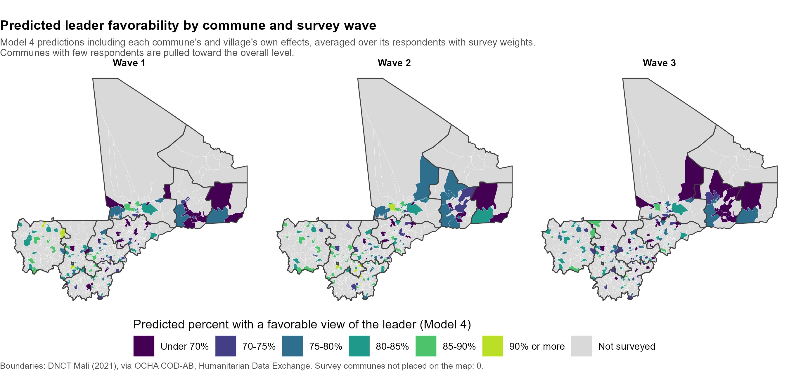

# Violence against civilians and leader favorability (Mali)

A reproducible R pipeline that asks one question: **in communes that experienced more violence against civilians, were people less likely to view the national leader favorably?** It combines a three-wave household survey with commune-level event counts from ACLED, fits a short ladder of multilevel models, checks what the survey design costs, and produces a policymaker-ready report with maps.

This README explains what the project does and how the pieces fit together. For every modeling decision, the exact equations, and how to read the results, see **[`MODELING_NOTES.md`](MODELING_NOTES.md)**. It is written to be handed to an AI assistant (or a colleague) as full context.

---

## The question, in plain terms

A household survey asked people in Mali whether they view the national leader favorably. ACLED (the Armed Conflict Location & Event Data project) records political violence, including events of **violence against civilians**. The project team counted those events for each surveyed commune (the third administrative level, below region and cercle) during each wave's fieldwork window.

The analysis asks whether people in communes with more of these events were less favorable than people in communes with fewer, comparing people surveyed in the *same region and wave*.

Two things make this harder than it looks:

1. **The effect is subtle.** About 80% of respondents view the leader favorably in every wave. Near a ceiling, even a real association moves the percentage only a few points, so the analysis is built to estimate it carefully and fixes its choices in advance rather than searching for a significant result.
2. **People are clustered.** Respondents in the same commune share the same violence count and resemble each other. The models handle this either with a commune random effect (multilevel models) or with the survey design (strata, communes, villages, weights). The analysis does both and compares them.

---

## How the pipeline is organized

  

*(Diagram source: `output/pipeline.mmd`.)*

Rendering `analysis.qmd` runs everything: it loads the packages, then sources `R/models.R` (which sources `R/prep_data.R`) and `R/maps.R`. You only edit `R/prep_data.R` to point it at your data.

### 1. Prepare the data: `R/prep_data.R`

Reads the survey, renames columns to a standard set, and builds:
- the violence measure, `log(1 + events)`, plus its split into a commune's usual level and its change from that level;
- the design variables, made wave-specific because each wave is its own sample, with weights rescaled within wave.

### 2. Fit the models: `R/models.R`

Each model adds one thing, so the reasoning is visible:

| Model | What it adds | What it answers |
|---|---|---|
| M1 | Commune random intercept only | How much of favorability lies between communes (the ICC)? |
| M2a / M2b | Violence; then a random violence slope | Does the violence effect differ across communes? (likelihood ratio test) |
| M3a | Region dummies (Bamako reference), wave dummies (wave 1 reference), covariates | Violence, comparing communes in the same region and wave |
| M3b | + region-by-wave random intercept | Are there region-wave shocks? (likelihood ratio test and AIC pick M3a or M3b) |
| **M4** | + village random intercept and the log survey weight | **Final model**: the design inside the multilevel model |

A survey-weighted `svyglm` fit is kept as a design-based check. A sensitivity version of M3 separates a commune's usual level of violence from its wave-to-wave change. Effects are reported as log-odds, odds ratios, percentage points, and **predicted favorability at 0, 1, 5, and 20 events**, which is the number a non-technical reader can act on.

### 3. Map it: `R/maps.R`

Commune maps for each wave, built entirely offline from the OCHA boundary file (no map service or internet access). Survey communes join to the boundaries by their region and commune keys. Communes that weren't surveyed are gray, visually distinct from a commune that *was* surveyed and had zero events.

  

  

### 4. Render the report: `analysis.qmd`

A single PDF with the question, the design, every model equation, jtools coefficient tables, the random slope test, the design cost, predicted favorability, `performance` diagnostics (ICC, AIC/BIC, collinearity, binned residuals, convergence), the maps, a plain-language summary, and limitations.

---

## Run order

| Step | Action |
|---|---|
| 1 | Open `violence_favorability.Rproj` in RStudio |
| 2 | Edit `R/prep_data.R`: file path and column names (section 1 and 2) |
| 3 | Render `analysis.qmd` (or `source("R/models.R")` to work in the console) |

---

## Folders

| Folder | Contents |
|---|---|
| `R/` | `prep_data.R` (edit for new data), `models.R`, `maps.R`, `boundaries.R` (helpers) |
| `boundaries/` | OCHA map layers and admin dictionary. Do not edit; see [`boundaries/SOURCE.md`](boundaries/SOURCE.md) |
| `data/` | The survey file |
| `output/` | Maps (PDF and PNG) and the pipeline diagram |
| `testing/` | Simulated data with known answers and a full test run. Delete when no longer needed |

---

## References

- **Boundaries:** OCHA. *Mali: Subnational administrative boundaries (COD-AB), levels 0 to 3.* Source: Direction Nationale des Collectivités Territoriales (DNCT), 2021. Humanitarian Data Exchange (HDX). 701 communes, 53 cercles, 10 regions, with official P-codes. Details in [`boundaries/SOURCE.md`](boundaries/SOURCE.md).
- **Violence events:** Raleigh, C., Linke, A., Hegre, H., & Karlsen, J. (2010). Introducing ACLED: An armed conflict location and event dataset. *Journal of Peace Research, 47*(5), 651-660.
- **Survey variance estimation:** Binder, D. A. (1983). On the variances of asymptotically normal estimators from complex surveys. *International Statistical Review, 51*(3), 279-292.
- **Complex survey analysis in R:** Lumley, T. (2010). *Complex surveys: A guide to analysis using R*. Wiley.
- **Within/between decomposition:** Mundlak, Y. (1978). On the pooling of time series and cross section data. *Econometrica, 46*(1), 69-85; Bell, A., & Jones, K. (2015). Explaining fixed effects. *Political Science Research and Methods, 3*(1), 133-153.
- **Conditional vs. population-averaged effects:** Zeger, S. L., Liang, K.-Y., & Albert, P. S. (1988). Models for longitudinal data: A generalized estimating equation approach. *Biometrics, 44*(4), 1049-1060.
