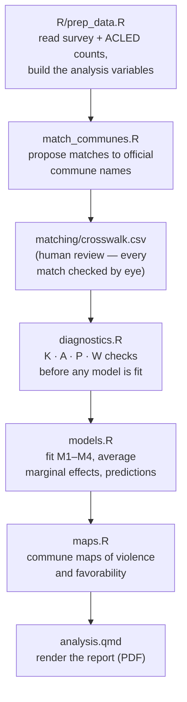
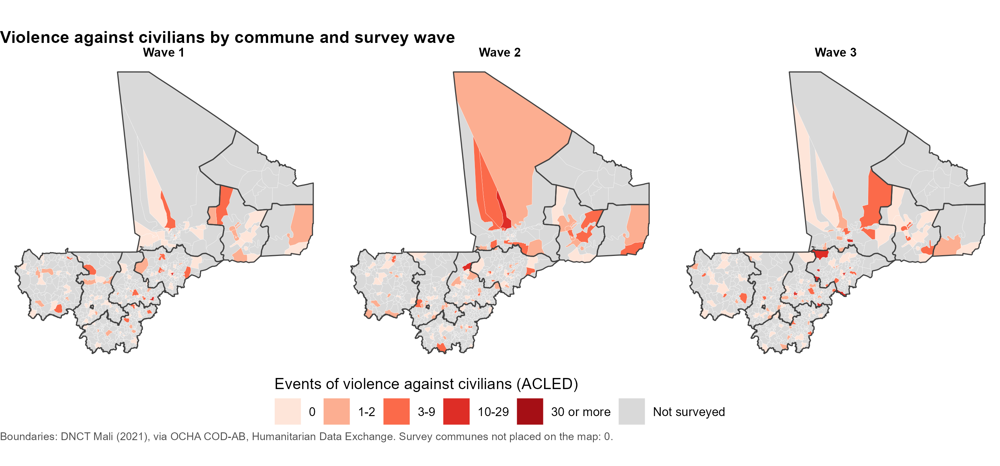
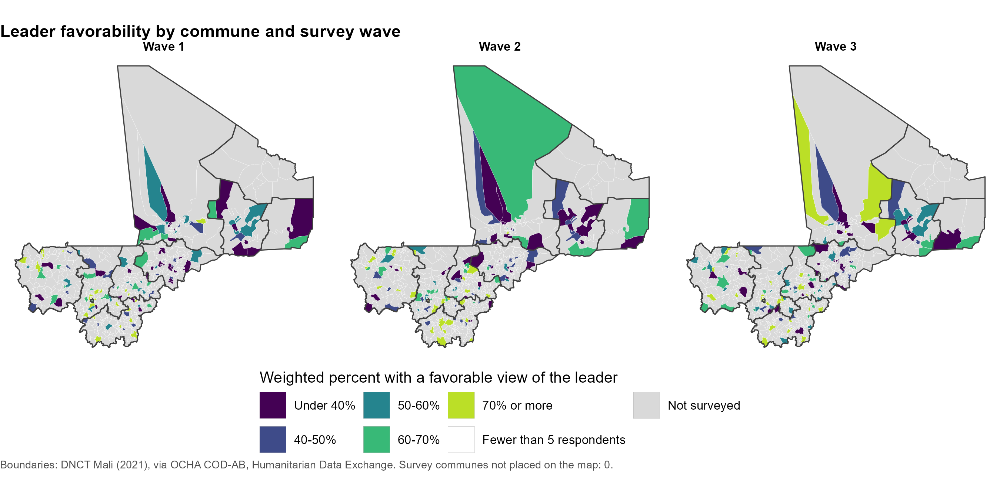

# Violence against civilians and leader favorability (Mali)

A reproducible R pipeline that asks one question: **in communes that experienced more violence against civilians, were people less likely to view the national leader favorably?** It combines a three-wave household survey with commune-level event counts from ACLED, respects the survey's complex design (strata, clusters, weights) at every step, and produces a short, policymaker-ready report with maps.

This README explains what the project does and how the pieces fit together. For every modeling decision, the exact equations, and how to read the results, see **[`MODELING_NOTES.md`](MODELING_NOTES.md)** — it's written to be handed to an AI assistant (or a colleague) as full context on this project.

---

## The question, in plain terms

A household survey asked people in Mali whether they view the national leader favorably. Separately, ACLED (the Armed Conflict Location & Event Data project) tracks political violence worldwide, including events of **violence against civilians** — who, where, and when. The project team matched ACLED events to the communes (the third-level administrative unit in Mali, below region and cercle) that were surveyed, in each of the three survey waves.

The analysis asks whether people living in communes with more of these events were less favorable toward the leader than people in communes with fewer — comparing people surveyed in the *same region and wave*, so the comparison isn't confounded by broad regional or time trends.

That sounds simple, but two things make it easy to get wrong:

1. **The geography matters.** Violence counted at the *region* level barely varies once you've already controlled for region (unsurprising — a region's violence total is largely explained by which region it is). Counting violence at the *commune* level, where it actually happened, gives the model something real to work with. The diagnostics step (below) checks this directly instead of assuming it.
2. **The survey isn't a simple random sample.** Respondents were selected through strata, clusters (communes and villages), and unequal probabilities, summarized in sampling weights. Ignoring that design produces standard errors that are too small and p-values that look more impressive than they should.

---

## How the pipeline is organized

Each script sources the one before it, so running `analysis.qmd` runs the whole chain. You only ever *edit* `R/prep_data.R` (to point it at your data) and review the matching file by hand — everything downstream is computed, not typed in.

### 1. Prepare the data — `R/prep_data.R`

Reads the raw survey file, renames columns to a standard set (see the data contract in `MODELING_NOTES.md` §4), merges in the ACLED commune-wave counts, and builds the exposure variable: `log(1 + events)`. This is the only script meant to be edited when new data arrives.

### 2. Match commune names — `match_communes.R`

Survey commune names are typed by hand across three waves and don't always match the official spelling. This script proposes candidate matches to the **OCHA official commune list** (see References) by comparing cleaned names (accents, case, and punctuation stripped) within the same region, and flags each one as an exact match, an ambiguous match (the name exists more than once in the region), or needs review (no exact match — the closest candidates are listed).

**Nothing is matched automatically.** The draft goes to `matching/crosswalk_draft.csv`; a person reviews every non-exact row and saves the confirmed version as `matching/crosswalk.csv`. A wrong commune on a map handed to a policymaker is a real harm, so this step is deliberately manual. Tested against simulated data with known answers, the suggestion list contained the correct commune in every case that needed review.

### 3. Diagnose before modeling — `diagnostics.R`

Checks the data structure *before* any outcome model is fit, so the modeling choices follow from the data rather than from which results look good:

| Check | What it tells you |
|---|---|
| **K** | How many commune-wave cells have a violence count |
| **A** | How much of the violence exposure is just "which region and wave" — if this is high, a region-level model literally cannot separate a violence effect from a region effect |
| **P** | How many villages were sampled per commune, on average |
| **W** | How much violence varies *within* the same commune across waves, versus *between* communes |

### 4. Fit the models — `models.R`

Four models build toward the main specification, each changing one thing at a time, so the reasoning is visible rather than asserted:

| Model | Exposure measured at | Accounts for survey design? | Role |
|---|---|---|---|
| M1 | Region × wave | Yes | Shows why region-level violence doesn't work |
| M2 | Commune × wave | No | Naive baseline for comparison |
| M3 | Commune × wave | Random intercept per commune | Multilevel alternative |
| **M4** | Commune × wave | **Yes — this is the main model** | Design-based estimate (strata, clusters, weights) |

Effects are reported as **average marginal effects** (percentage points) and as **predicted favorability** at a few representative violence counts (0, 1, 5, 20 events) — numbers a non-technical reader can act on, rather than log-odds coefficients.

### 5. Map it — `maps.R`

Commune-level choropleth maps of violence and favorability for each wave, built entirely offline from the OCHA boundary file (no map API or internet access needed). Communes that weren't surveyed are shown in gray — visually distinct from a commune that *was* surveyed and had zero events, which matters a lot when the map goes to someone making decisions from it.

  

  

### 6. Render the report — `analysis.qmd`

Pulls everything together into a single PDF: the question, the design, the diagnostics, the models and their equations, the headline predicted-favorability table, the maps, and a set of model checks (leave-one-region-out stability, calibration, binned residuals).

---

## Run order

| Step | Command | When |
|---|---|---|
| 1 | Edit `R/prep_data.R` | Once per dataset: file path and column names |
| 2 | `source("match_communes.R")` | Whenever survey commune names change |
| 3 | Review `matching/crosswalk_draft.csv`, save as `matching/crosswalk.csv` | By hand, after step 2 |
| 4 | `source("diagnostics.R")` | Before modeling — read K, A, P, W |
| 5 | `source("models.R")` | Fits M1–M4, prints results |
| 6 | Render `analysis.qmd` | Produces the PDF report; maps also save to `output/maps/` |

Open `violence_favorability.Rproj` in RStudio first, so every script runs relative to the project folder.

---

## Folders

| Folder | Contents |
|---|---|
| `R/` | `prep_data.R` (edit this for new data), `boundaries.R` (name-cleaning and boundary-reading helpers) |
| `boundaries/` | The OCHA map layers and commune dictionary, already built — see [`boundaries/SOURCE.md`](boundaries/SOURCE.md). Don't edit. |
| `matching/` | Survey commune list, the draft match proposals, and the human-reviewed crosswalk |
| `output/maps/` | Publication copies of the maps (PDF and PNG) |
| `testing/` | Simulated data with a known answer, used to validate the pipeline — not needed for a real run, but a good way to confirm the code still behaves the same way after an R or package upgrade |
| `setup_done_do_not_rerun/` | The one-time boundary build (raw OCHA shapefiles → `boundaries/`). Already run; kept only in case boundaries ever need rebuilding — see its own README. |

`MODELING_NOTES.md` is the deeper reference: every modeling judgment and why it was made, the exact equations and variance formula, how to read each output, a troubleshooting table, and the full decisions log (including approaches that were considered and rejected, like machine learning predictors, a Bayesian model, and cercle-level aggregation).

---

## References

- **Boundaries:** OCHA. *Mali: Subnational administrative boundaries (COD-AB), levels 0–3.* Source: Direction Nationale des Collectivités Territoriales (DNCT), 2021. Humanitarian Data Exchange (HDX). 701 communes, 53 cercles, 10 regions, with official P-codes. Full citation and notes on the release in [`boundaries/SOURCE.md`](boundaries/SOURCE.md).
- **Violence events:** Raleigh, C., Linke, A., Hegre, H., & Karlsen, J. (2010). Introducing ACLED: An armed conflict location and event dataset. *Journal of Peace Research, 47*(5), 651–660.
- **Survey variance estimation:** Binder, D. A. (1983). On the variances of asymptotically normal estimators from complex surveys. *International Statistical Review, 51*(3), 279–292.
- **Complex survey analysis in R:** Lumley, T. (2010). *Complex surveys: A guide to analysis using R*. Wiley.
- **Within/between decomposition:** Mundlak, Y. (1978). On the pooling of time series and cross section data. *Econometrica, 46*(1), 69–85; Bell, A., & Jones, K. (2015). Explaining fixed effects. *Political Science Research and Methods, 3*(1), 133–153.
- **Marginal vs. conditional effects in mixed logit models:** Zeger, S. L., Liang, K.-Y., & Albert, P. S. (1988). Models for longitudinal data: A generalized estimating equation approach. *Biometrics, 44*(4), 1049–1060.

The full reference list with page-level context for each citation is in `MODELING_NOTES.md` §16.
