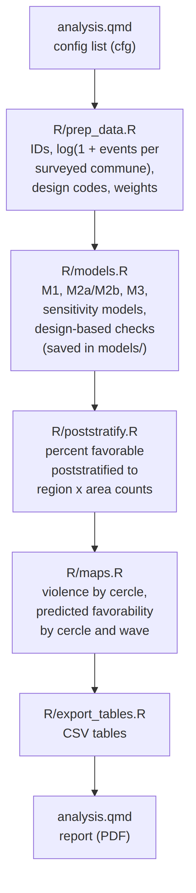
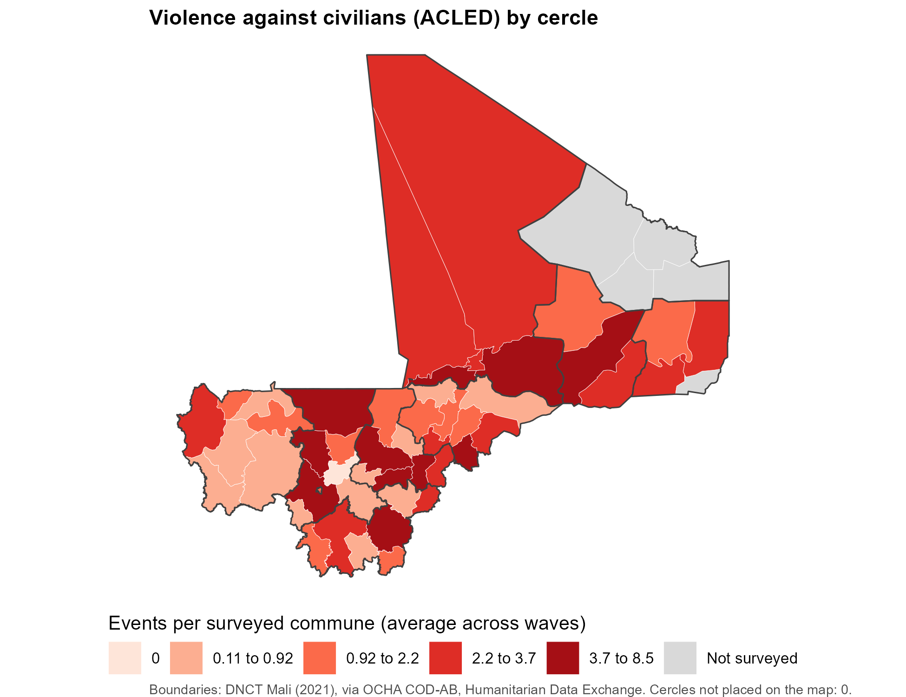
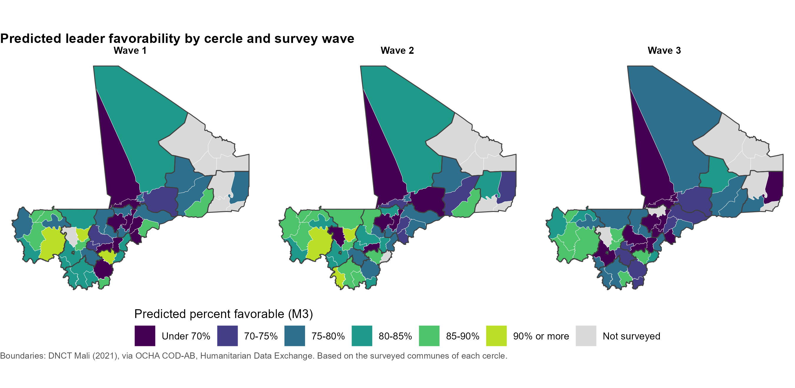

# Violence against civilians and leader favorability (Mali)

A reproducible R pipeline that asks one question: **in cercles that experienced more violence against civilians, were people less likely to view the national leader favorably?** It combines a three-wave household survey with cercle-level event counts from ACLED, fits a short ladder of multilevel models, checks what the survey design costs, and produces a policymaker-ready report with maps.

This README explains what the project does and how the pieces fit together. For every modeling decision, the exact equations, and how to read the results, see **[`MODELING_NOTES.md`](MODELING_NOTES.md)**. It is written to be handed to an AI assistant (or a colleague) as full context.

---

## The question, in plain terms

A household survey asked people in Mali whether they view the national leader favorably. ACLED (the Armed Conflict Location & Event Data project) records political violence, including events of **violence against civilians**. The project team counted those events for each surveyed cercle (the second administrative level, below region) during each wave's fieldwork window, summed over the communes surveyed there. Because a cercle with more surveyed communes would collect more events, the pipeline divides each count by the number of surveyed communes.

The analysis asks whether people in cercles with more of these events were less favorable than people in communes with fewer, comparing people surveyed in the *same region and wave*.

Two things make this harder than it looks:

1. **The effect is subtle.** About 80% of respondents view the leader favorably in every wave. Near a ceiling, even a real association moves the percentage only a few points, so the analysis is built to estimate it carefully and fixes its choices in advance rather than searching for a significant result.
2. **People are clustered.** Respondents in the same cercle and wave share the same violence count and resemble each other. The multilevel models use cercle and cercle-by-wave random intercepts; the design-based check uses the survey design (strata, communes as sampling units, weights). The analysis does both and compares them.

---

## How the pipeline is organized

  

All settings live in one **config list (`cfg`) at the top of `analysis.qmd`**: the data file, the population counts file, violence count, two covariate sets (M2a and M2b) and which one carries into the final model, and whether to refit models. The data file is prepared upstream with fixed column names (see `R/prep_data.R`). Rendering `analysis.qmd` runs everything. Nothing else needs editing to swap a covariate or the violence measure.

| Script | What it does |
|---|---|
| `R/prep_data.R` | Builds the analysis file: IDs, violence as log(1 + events per surveyed commune), wave-specific design codes and weights |
| `R/models.R` | Fits the model sequence, sensitivity models, and design-based checks; computes effects and predictions; each model is saved in `models/` and reloaded (set `refit = TRUE` after changes) |
| `R/poststratify.R` | Poststratifies the survey design to region x area population counts (percent favorable in the adult population) |
| `R/maps.R` | Violence by cercle, and predicted favorability by cercle and wave, built offline from the OCHA boundaries |
| `R/export_tables.R` | Writes M3 results, predictions, and poststratified estimates to `output/tables/` as CSV |
| `analysis.qmd` | Config, packages, and the report (PDF) |

### The models

| Model | Adds | Compared by |
|---|---|---|
| M1 | cercle and cercle-by-wave random intercepts (always both: violence takes one value per cercle and wave) | |
| M2a | violence, wave, region, urban, covariate set A | |
| M2b | the same with covariate set B | checks the violence estimate does not depend on the covariate choice |
| M3 | the chosen M2 + log survey weight | final model; design-based check with `svyglm` clustered at the cercle |

Effects are reported as log-odds, odds ratios, percentage points, and predicted favorability at a few event counts, with a minimum detectable effect so that a non-significant result can be explained honestly. Sensitivity models add a commune intercept, use the full design strata, test whether the violence slope depends on the weights, and split violence into the cercle's usual level and its change from wave to wave. Percent favorable in the adult population is estimated by poststratifying the survey weights to region x area counts. M3's results and predictions are also written to CSV.

  

  

## Run order

| Step | Action |
|---|---|
| 1 | Open `violence_favorability.Rproj` in RStudio |
| 2 | Edit the `cfg` list at the top of `analysis.qmd` |
| 3 | Render `analysis.qmd`; after changing data, covariates, or switches set `refit = TRUE`, then back to `FALSE` |

## Folders

| Folder | Contents |
|---|---|
| `R/` | `prep_data.R`, `models.R`, `poststratify.R`, `maps.R`, `export_tables.R`, `boundaries.R` |
| `boundaries/` | OCHA layers and admin dictionary (do not edit) |
| `data/` | The survey file and the region x area population counts (`population_example.csv` is a placeholder) |
| `models/` | Saved model fits (safe to delete; they are rebuilt) |
| `output/` | Maps, CSV tables (`output/tables/`), and the pipeline diagram |

`MODELING_NOTES.md` explains every decision, how to read each result, and how an AI assistant should help with this code.

## References

- **Boundaries:** OCHA. *Mali: Subnational administrative boundaries (COD-AB), levels 0 to 3.* Source: Direction Nationale des Collectivités Territoriales (DNCT), 2021. Humanitarian Data Exchange (HDX). 701 communes, 53 cercles, 10 regions, with official P-codes. Details in [`boundaries/SOURCE.md`](boundaries/SOURCE.md).
- **Violence events:** Raleigh, C., Linke, A., Hegre, H., & Karlsen, J. (2010). Introducing ACLED: An armed conflict location and event dataset. *Journal of Peace Research, 47*(5), 651-660.
- **Clustering for an aggregate exposure:** Moulton, B. R. (1990). *Review of Economics and Statistics, 72*(2), 334-338; Abadie, A., Athey, S., Imbens, G. W., & Wooldridge, J. M. (2023). *Quarterly Journal of Economics, 138*(1), 1-35.
- **Survey variance estimation:** Binder, D. A. (1983). On the variances of asymptotically normal estimators from complex surveys. *International Statistical Review, 51*(3), 279-292.
- **Complex survey analysis in R:** Lumley, T. (2010). *Complex surveys: A guide to analysis using R*. Wiley.
- **Weighting in multilevel models:** Pfeffermann, D., Skinner, C. J., Holmes, D. J., Goldstein, H., & Rasbash, J. (1998). *JRSS-B, 60*(1), 23-40; Gelman, A. (2007). *Statistical Science, 22*(2), 153-164.
- **Within/between decomposition:** Mundlak, Y. (1978). On the pooling of time series and cross section data. *Econometrica, 46*(1), 69-85; Bell, A., & Jones, K. (2015). Explaining fixed effects. *Political Science Research and Methods, 3*(1), 133-153.
- **Conditional vs. population-averaged effects:** Zeger, S. L., Liang, K.-Y., & Albert, P. S. (1988). Models for longitudinal data: A generalized estimating equation approach. *Biometrics, 44*(4), 1049-1060.
